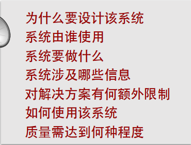
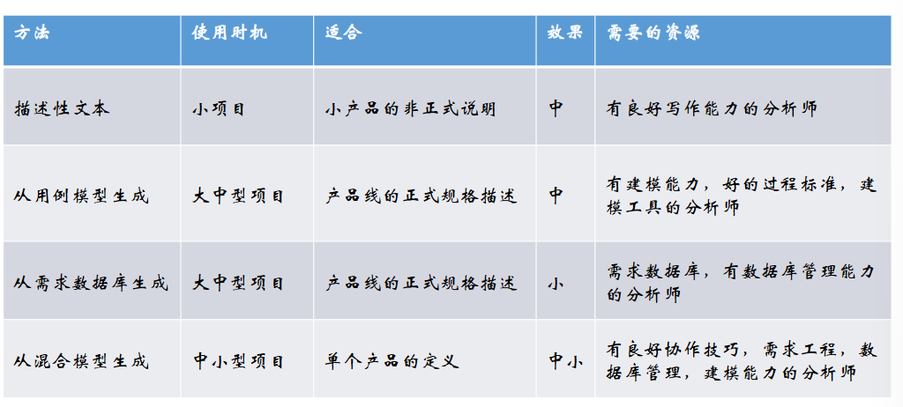
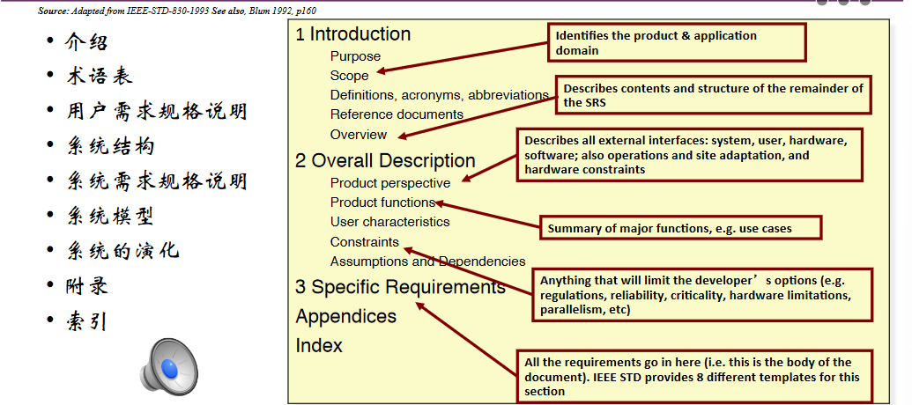
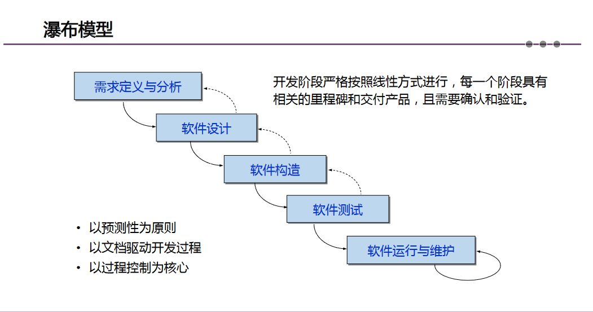
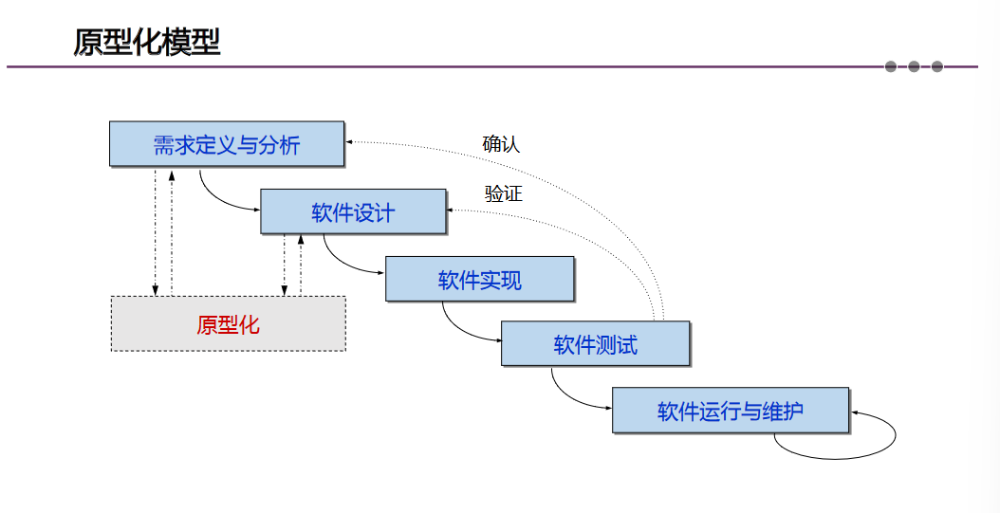

# 软件的需求管理

## 软件需求的定义

  **需求**是对外可见的系统特征

  需求管理有三项任务：
  - 学习 ——需求获取
  - 剪枝 ——需求优选
  - 文档化 ——撰写需求规格说明书
  
### 需求的内容
  - 需求是系统为满足客户期望的目标而完成的行为
  - 需求要体现出对问题领域的清晰理解
  - 给出系统的使用场景和上下文
  
  

### 需求规约
 #### 单个需求项的质量:
- 准确（Concise）
- 正确（Correct）
- 明确（Non-ambiguous）
- 可行（Feasible）
- 可证（Verifiable）
  
#### 整个需求集合的质量:
- 现实（Realistic）
- 精确（Concise）
- 全面（Complete）
- 一致（Consistent）

## 获取软件需求的主要途径

需求分析师与客户沟通，制定需求文档

## 软件需求文档的框架

### 需求文档的组织形式
#### 文档需要有逻辑组织结构
- 例如：参照IEEE的模板
#### 典型的组织形式包括
- 按系统能够响应的各种外环境情况来组织
- 按系统特征来组织
- 按系统的响应方式来组织
- 按所管理的外部数据对象组织
- 按用户类型来组织
- 按软件的工作模式来组织
- 按子系统的划分来组织

### *软件需求规格说明SRS的风格*

#### 描述性的自然语言文本
• 用户故事
#### 从用例模型产生
• 用例模型与需求转化可看成可逆的过程
• 如果需求模型以用例的形式表示，我们
可以逆向生成需求的完整集合
#### 从需求数据库中生成
• 商业需求数据库有内置的功能来
生成经过筛选的需求规格说明
• 从产品线需求规格数据库中生成
特定产品的需求规格说明
#### 从混合模型中生成
• 特征模型和用例模型

### 选择合适的需求规格说明方式
- 小型项目，1名程序猿，2个月的开发周期
程序猿直接和用户对话，写了两页纸的备忘录
- 大型项目，50 名程序猿，2年的开发周期
专门的团队进行需求建模与分析，撰写了500页的需求规格说明

### 生成不同风格SRS的方法

### 用户手册大纲

#### 介绍
• 产品总览及基本原理
• 术语和基本特征
• 展示格式与报表格式的总结
• 手册的大纲
#### 开始
• 开始指令
• 帮助模式
• 样例运行
#### 操作模式:
• 命令行/对话框/报告
#### 高级特性
#### 命令语法和系统选项

### 开发过程中各人员的分工

### 高质量需求规格说明

#### 一个高质量的需求规格说明
- 是所有需求的集合
- 描述产品要提供的所有-能
- 是软件系统解决方案的-业合同的基础
- 是测试计划的基础
- 定义产品需求的度量标准
- 是产品需求跟踪的先决-件
- 影响开发产品的项目计划

### 需求规格说明SRS模板
- SRS需要根据预先定义-标准章节模式来组织，即-据模板来撰写
- SRS的模板使得撰写统-的SRS变得简单
- 对于QA人员来说定义SR-指标变得简单
- 模板也适用于业务需求-系统需求
- 模板可以被用于半自动地从需求数据库或者用例模型生成SRS

### IEEE-830 SRS模板大纲

### SRS模板的优缺点
#### 优点
- 模板提高效率
- 在有模板的情况下，面对一个完整的大纲，不容易遗漏重要的信息
#### 缺点
- 并非对于所有的系统，模板的章节设计都是类似的
- 如果仅仅为了满足标准，而填写模板的所有章节，在不相关的章节，会加入一些没有意义的内容
- 读者很难将这些无意义的文字和真正
的需求分开

### 总结

- 尽快开始写需求
- 确定哪些属性将被用于分类和细化需求
- 产生一个初始版本来刺激反馈
- 询问用户往往比咨询专家更有用
- 撰写需求时需要遵循的法则：
  - 使用简单、直接的语言
  - 撰写可测试的需求
  - 使用定义好的并达成共识的术语
  - 一次只写一项需求
## 需求工程师的职责

### 当代的需求工程师
- 分析问题和解决问题能力
- 人际沟通及交流能力
- 软件工程知识和技能
- 应用领域有关知识
- 书面语言组织和表达能力

### 优秀需求工程师的目标
- 识别错误假设
- 确保一致性
- 提升依从性
- 减少彼此误解
- 提高支持速度和效率
- 提升客户满意度
- 撰写优质需求文档

### 需求分析师七宗罪
- 干扰
- 沉默
- 过度规约
- 矛盾
- 含糊
- 向前引用
- 不切实际与一厢情愿

# 软件开发过程
## 软件过程模型

软件过程模型是对软件过程的抽象描述，是定义任务之间关系和规程和方法

### 四种模型：瀑布模型、原型化模型、迭代式开发模型、可转换模型 
#### 瀑布模型

将基本的开发活动看成是一系列界限分明的独立阶段，这是 一种计划驱动的软件过程，有利于规范软件开发活动。以预测性为原则 、以文档驱动开发过程 、以过程控制为核心。

#### 原型化模型
原型是一个部分开发的产品，用于加强对系统的理解，有助于明确需求和选择可行的设计策略。

#### 迭代式开发模型

将描述、开发和验证等不同活动交织在一起，在开发过程中 建立一系列版本，将系统一部分一部分地逐步交付。

##### 特点：

- 更快速地发布产品
 
- 追求产品创新
 
- 需求不确定性高
 
- 需要快速响应用户的变化
 
- 关注用户行为

#### 增量模型：在每一个新的发布中逐步增加功能直到构造全部功能。

#### 迭代模型：一开始提交一个完整系统，在后续发布中补充完善各子系统功能。

#### 可转换模型 

- 利用自动化的手段，通过一系列转换将需求规格说明转化为 一个可交付使用的系统。

- 由于数学方法具有严密性和准确性，形式化方法所交付 的系统具有较少的缺陷和较高的安全性。 • 特别适合于那些对安全性、可靠性和保密性要求极高的 软件系统，这些系统需要在投入运行前进行验证。

> 原型化模型和瀑布模型的区别：
  - 原型化模型第一步就是创建一个快速原型，能够满足项目干系人与未来的用户可以与原型进行交互，再通过与相关干系人进行充分的讨论和分析，最终弄清楚当前系统的需求，进行了充分的了解之后，在原型的基础上开发出用户满意的产品。
  - 而对于瀑布型，有点太过于理想化，现实中还是先制作出一个模型让客户看见更能有助于开发软件。
> 迭代模型，摒弃了传统的需求分析，设计，编码，测试的流程，而是将整个生命周期变成若干个冲刺（Sprint）阶段，而每一个阶段都是由以上若干或者全部传统的流程组成，在每一个阶段中，都会包含下面四个阶段：初始阶段，细化阶段，构建阶段，交付阶段。在初始阶段中，确认本次冲刺的范围，边界，系统选择的架构，计划，以及所需要的资源等信息。在细化阶段中，对问题进行建域，创建开发案例，创建模板以及准备工具等。在构建阶段的主要任务就是完成构建的开发并且进行测试，将完成的构建集成为产品，并且测试所有的功能（CI）。在交付阶段，主要是完成本次冲刺，将软件产品交付给相关的干系人。

> 可转换模型与他们有很大区别，它通过将无法直接测试的需求转换成可以直接测试的需求，保证了模型的安全、可靠、严密。
# 个人总结
这次课程的需求文档撰写令我印象深刻。

在现实的软件制作过程中，需求常常是不断变动的，甚至是推倒原有，重新制定的，可谓计划赶不上变化。作为软件开发人员，应当适应这种变化，就像课程里说的那样，不能将变化视为威胁，应当作为一种机遇，一种挑战。在这样一种不断变动的情况下，需求文档的撰写就变得格外的重要，负责和客户沟通，确定需求文档的需求分析师责任重大，他需要识别用户真正的需求，将其抽象，简化，再以文档的形式传达给开发的人员。作为沟通的桥梁，一个“翻译者”，他的水平决定了整个项目的下限！

由此可见**需求分析**的重要性，在我看来一个软件的开发近半的时间应当放在需求分析，更改沟通交流上，毕竟当真正的文档确定，实现起来有了目标与细则，会十分迅速的！

需求文档的撰写作为软件工程的“开头难”，是我们计算机专业学生所要格外重视的！

